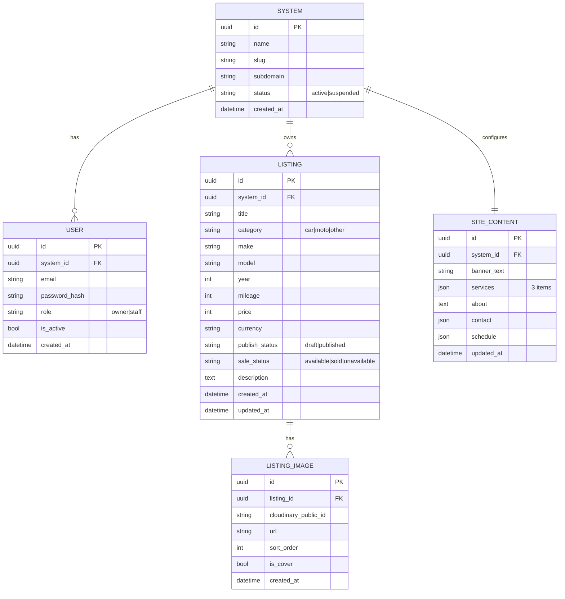

# Dealer Desk — Versión SaaS (multi‑dealer / multi‑tenant)

> Objetivo: **un solo producto** que permite a distintos clientes (dealers) administrar su inventario (autos, motos u otros) y publicarlo en **su propia web pública**.

---

## 0) Resumen del producto

**Dealer Desk** tiene 2 partes:

1) **Web pública (por dealer):** muestra inventario publicado y páginas informativas.  
   Páginas MVP: **Home**, **Services**, **Destacados** (sección dentro de Home), **Cars for Sale** (listado), **Ficha**, **Contact**.

2) **Panel privado (por dealer):** el dealer inicia sesión y administra:
   - Publicaciones (crea/edita fotos, marca vendido(franja), baja del sitio, etc.)
   - Contenido del sitio (banner/franja, 3 servicios, about, horario, contactos).

---

## 1) Concepto SaaS (por qué existe esta versión)

En SaaS, **hay múltiples dealers/tenants**.  
Ejemplo: un cliente vende autos y otro vende motos. Ambos usan Dealer Desk, pero:
- Cada uno tiene su **propio panel** y **su propia web pública**.
- Sus datos no se mezclan (aislamiento por `system_id`).

**Super Admin (tú):** administra la plataforma y crea/gestiona los sistemas (tenants).  
No tiene sentido crear “otro usuario que cree sistemas”; basta con que **tú seas Super Admin** del producto.

---

## 2) Alcance MVP (SaaS)

### 2.1 Web pública (por dealer)
- Home (incluye sección Destacados)
- Services
- Cars for Sale (listado + filtros)
- Detalle/Ficha (galería + specs + CTA)
- Contact

**Listado (Cars for Sale)**
- Filtros MVP: **precio**, **año**, **marca/modelo**, **millas**.
- Orden por defecto: **más nuevos**.
- **UX tarjeta**
  - Desktop: toda la tarjeta es clickeable (y puede tener hover).
  - Mobile: **sin botón “Ver”**; tocar imagen o tarjeta abre la ficha.

### 2.2 Panel privado (por dealer)
- Login
- Dashboard (métricas simples opcional)
- CRUD de publicaciones (inventario)
- Subida/orden de fotos (Cloudinary)
- Estados de publicación (ver sección 4)
- Gestión de contenido del sitio:
  - Franja/banner
  - 3 servicios
  - About
  - Horario
  - Contactos

---

## 3) Roles y permisos (SaaS)

### Roles
- **Super Admin (plataforma):** crea/suspende/reactiva sistemas, ve overview global.
- **Owner (dealer):** dueño del sistema; controla usuarios y publicaciones.
- **Staff (dealer):** apoyo operativo (carga publicaciones), con restricciones.

### Reglas clave
- **Owner** puede:
  - crear/editar/eliminar staff
  - crear/editar publicaciones
  - publicar/despublicar (cambiar draft/published)
- **Staff** puede:
  - crear publicaciones
  - editar publicaciones **solo si están en draft**
  - no puede publicar
- Si una publicación está **published**, el staff **no la edita**.  
  Para editar: Owner debe pasarla a **draft**.

### 2FA (Owner)
- En cada login del Owner: **OTP por email** (2FA simple).
- Staff: login normal (sin OTP) en MVP.

---

## 4) Estados (unificados) para publicaciones

Usamos 2 estados (más limpio y escalable):

1) `publish_status`:  
   - `draft` (no visible en web)  
   - `published` (visible en web)

2) `sale_status`:  
   - `available`  
   - `sold`  
   - `unavailable` (baja administrativa / no disponible)

**Reglas**
- La web pública muestra **solo** `publish_status=published`.
- La marca “vendido” es `sale_status=sold` (sigue siendo visible si está published).
- **Eliminar**: solo se permite eliminar si `sale_status=unavailable` (con modal de confirmación).

---

## 5) Multi‑tenant (cómo se identifica el dealer)

**1 dealer por dominio/subdominio**.  
Recomendación práctica para el MVP SaaS:

- **Subdominio**: `dealer1.dealerdesk.com`  
  (más fácil para empezar)

Más adelante:
- Dominio propio (mapeo DNS) si el cliente lo necesita.

---

## 6) Modelo de datos (BBDD) — ERD

### Entidades principales (SaaS)

- **System (Tenant / Dealer)**: representa a un cliente.
- **User**: pertenece a un System (Owner/Staff).
- **Listing** (Publicación): pertenece a un System.
- **ListingImage**: imágenes asociadas a un Listing.
- **SiteContent**: contenido editable del sitio por System (banner, servicios, etc.)

### Diagrama ER (Mermaid)

---

## 7) Tecnologías (qué y por qué)

- **Backend:** Node.js + Express  
  - API REST clara, rápida para MVP, fácil de desplegar.
- **ORM:** Sequelize  
  - Modelos, relaciones, migraciones y validaciones.
- **DB:** PostgreSQL  
  - Relacional ideal para filtros, relaciones y consistencia.
- **Imágenes:** Cloudinary  
  - CDN, transformaciones, performance y menos carga en tu servidor.
- **Frontend web pública:** (a definir) React/Next o HTML/SSR simple  
  - MVP puede ser simple y evolucionar.
- **Panel Admin:** React (ideal) o plantilla simple con SSR (MVP rápido).

---

## 8) Deploy (costo fijo)

### Opción recomendada: VPS “todo en uno” + Cloudinary
- 1 VPS (Droplet/Hetzner/Vultr/Hostgator) 
- En el VPS:
  - Nginx (reverse proxy + SSL)
  - Node API (Docker)
  - PostgreSQL (Docker) + backups
- Cloudinary para imágenes

**Pros:** costo estable, control total.  
**Contras:** tú administras updates/seguridad/backups.
